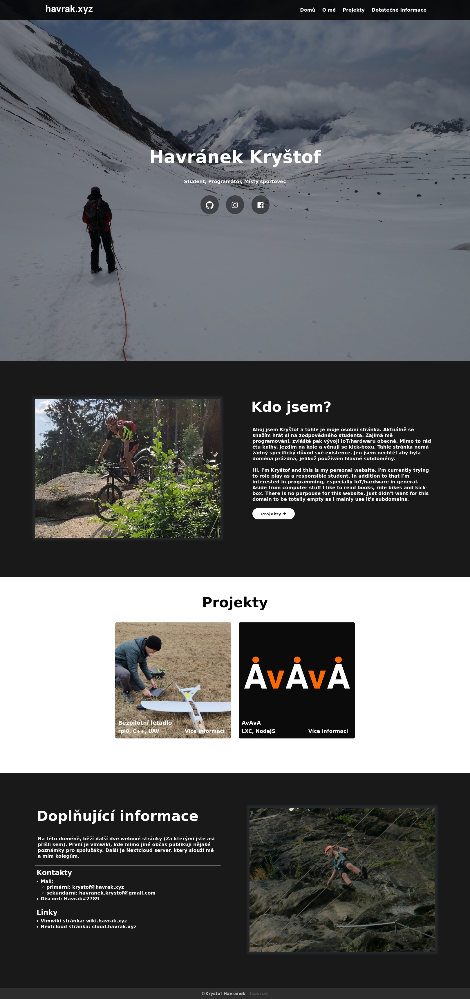

# HTML/CSS of my personal website

This repository contains code of my personal website [havarak.xyz](https://havrak.xyz)
It's a simple static website that's able to showcase some barebones information about me and my projects.

Code isn't super pretty as it was originally code written for local webdesign competition.
I just can't be bothered to write anything better as I use it just to have something on the domain.

